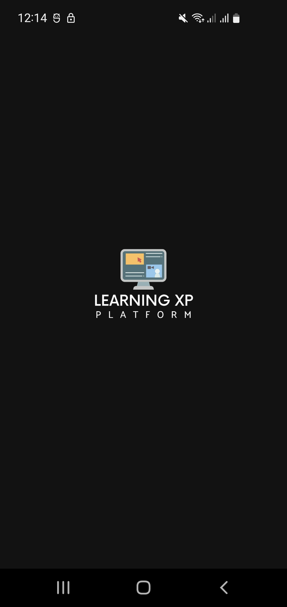
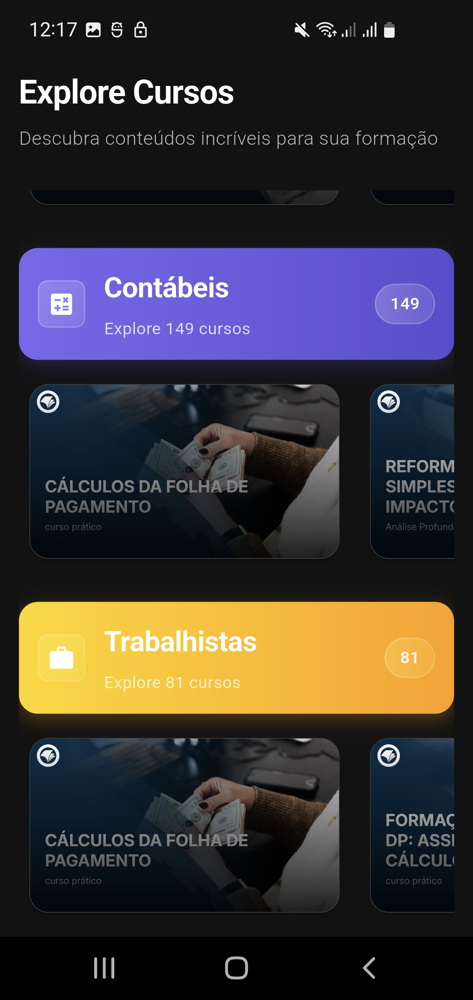
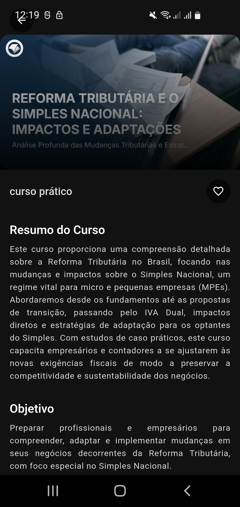
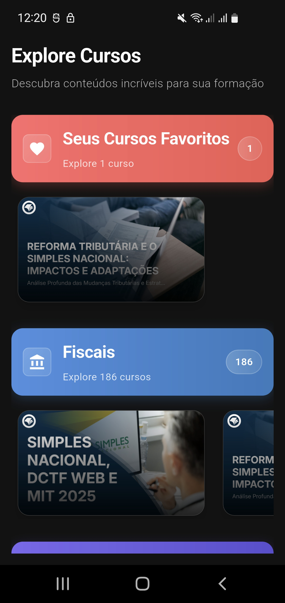

# LXP Platform
Este aplicativo consiste em uma plataforma para experiência de aprendizado (LXP) que permite aos usuários visualizar cursos online organizados por categorias e acessar detalhes de cursos, incluindo a funcionalidade de favoritar cursos.

## Tecnologias Utilizadas
- **Flutter**: Framework principal para desenvolvimento do aplicativo.
- **Dart**: Linguagem de programação.
- **Dio**: Para requisições HTTP à API.
- **CachedNetworkImage**: Para carregamento e cache de imagens.
- **SharedPreferences**: Para persistência local de cursos favoritados.
- **ConnectivityPlus**: Para verificação de conexão com a internet.
- **GetIt**: Para injeção de dependências.

## Estrutura do Projeto
O projeto segue uma arquitetura limpa com separação de camadas:
- **Core**: Contém utilitários, temas, constantes e configurações gerais.
- **Data**: Camada de dados com modelos, DTOs, repositórios e fontes de dados.
- **Features**: Cada funcionalidade (splash, course_list, course_details) possui sua própria pasta com controladores, casos de uso e UI.
- **Routes**: Gerenciamento de rotas do aplicativo.

## Como Executar o Aplicativo
Siga as instruções abaixo para rodar o projeto localmente:

### Pré-requisitos
- Flutter SDK (versão 3.10 ou superior)
- Dart
- Um dispositivo/emulador Android, iOS ou Web
- Conexão à internet para carregar os dados da API

### Passos para Instalação
1. **Clone o repositório**:
   ```bash
   git clone https://github.com/seu-usuario/lxp_platform.git

2. **Acesse o diretório do projeto**:
   ```bash
   cd lxp_platform

3. **Instale as dependências**:
   ```bash
   flutter pub get

4. **Execute o aplicativo**:
   ```bash
   flutter run

## Funcionalidades
1. **Tela de SplashScreen**:
- Exibe o logotipo e o nome do aplicativo por 2 segundos antes de redirecionar para a tela de listagem de cursos.

2. **Tela de Listagem de Cursos**:
- Exibe três categorias de cursos (Fiscal, Contábil e Trabalhista) em carrosséis horizontais.
- Consome os endpoints fornecidos pela API:
  - Fiscal: GET https://cefis.com.br/api/v1/event?c=fiscal
  - Contábil: GET https://cefis.com.br/api/v1/event?c=contabil
  - Trabalhista: GET https://cefis.com.br/api/v1/event?c=trabalhista
- Exibe uma categoria adicional chamada "Seus Cursos Favoritos" quando o usuário favorita cursos.
- Cada card no carrossel exibe o banner do curso como fundo e o título sobreposto.

3. **Tela de Detalhes do Curso**:
- Acessada ao clicar em um card na tela de listagem.
- Consome o endpoint GET https://cefis.com.br/api/v1/event/<courseId> para exibir detalhes como banner, subtítulo, resumo e objetivo.
- Inclui um botão para favoritar/desfavoritar o curso, utilizando SharedPreferences para persistência local.

4. **Favoritos**:
- Cursos favoritados são salvos localmente usando SharedPreferences.
- A categoria "Seus Cursos Favoritos" é atualizada dinamicamente na tela de listagem quando o usuário favorita ou desfavorita um curso.

### Adicionais
- Cache: Os dados dos cursos são armazenados em cache por 10 minutos para reduzir chamadas à API.
- Tratamento de Erros: O aplicativo lida com falhas de conexão e erros de servidor, exibindo mensagens amigáveis ao usuário.
- Responsividade: O layout foi projetado para se adaptar a diferentes tamanhos de tela usando a classe ResponsivityUtils.
- Tema: O aplicativo utiliza um tema escuro com cores personalizadas para uma experiência visual consistente.

## Telas do Aplicativo
<div style="display: flex; flex-wrap: nowrap;">
  
  
  
  
  
</div>
